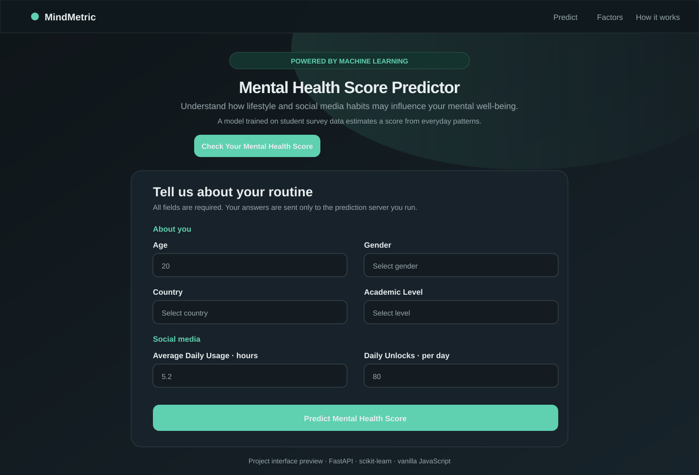

# Student Mental Health Score Predictor

A small full-stack project that estimates a student's mental health score from survey inputs about social media use, study habits, sleep, physical activity, and stress. The browser interface is built with HTML, CSS, and JavaScript; a FastAPI service sends validated input to a trained scikit-learn model.

> **Educational project only.** Predictions are model estimates from survey data. They are not a diagnosis or a substitute for professional mental health care.

## Project preview



## Features

- Responsive form with input validation and inline error messages.
- JSON prediction request to the FastAPI `/predict` endpoint.
- Prediction score display with a gauge and a short interpretation.
- Trained model artifact loaded from the project folder.

## Files

| File                                                | Purpose                                                   |
| --------------------------------------------------- | --------------------------------------------------------- |
| `index.html`                                        | Frontend page and prediction form                         |
| `style.css`                                         | Page styling and responsive layout                        |
| `script.js`                                         | Form validation, API request, and result display          |
| `main.py`                                           | FastAPI application and prediction endpoint               |
| `Mental_Health_Model.pkl`                           | Saved scikit-learn model pipeline                         |
| `Student Social Media And Mental Health Impact.csv` | Student survey dataset                                    |
| `Untitled.ipynb`                                    | Data exploration, model training, and evaluation notebook |
| `requirements.txt`                                  | Python dependencies                                       |

## Run locally

Use Python 3. Install the dependencies and start the API from this directory:

```bash
python -m pip install -r requirements.txt
uvicorn main:app --reload
```

The API will be available at `http://127.0.0.1:8000`. Its interactive API documentation is at `http://127.0.0.1:8000/docs`.

In a second terminal, serve the frontend from this directory:

```bash
python -m http.server 5500
```

Open `http://127.0.0.1:5500/` in your browser. Keep the API running while using the form. The frontend sends a `POST` request to the deployed API configured in `script.js`.

## Deploy the frontend on Render

Create a **Static Site** connected to this repository. Set the **Root Directory** to the repository root, leave **Build Command** empty, and set **Publish Directory** to `.`. Render serves `index.html` from the publish directory as the site root. Deploy the backend separately as a web service; if its URL changes, update `API_BASE_URL` in `script.js` to that service's base URL, without a trailing slash.

## Prediction API

`POST /predict` accepts JSON with these fields:

```json
{
  "age": 18,
  "gender": "Male",
  "country": "India",
  "academic_level": "Undergraduate",
  "most_used_platform": "Instagram",
  "purpose_of_use": "Entertainment",
  "avg_daily_usage_hours": 4.0,
  "daily_unlocks": 100,
  "study_hours": 5.0,
  "physical_activity_hours": 1.0,
  "sleep_hours_per_night": 7.0,
  "stress_level": "Medium"
}
```

The response contains `predicted_mental_health_score`, a numeric model estimate. The API validates the values and maps countries outside the training groups to `Other`.

## Model notes

The notebook prepares the survey data, groups less common countries, trains regression pipelines, and saves a Random Forest pipeline to `Mental_Health_Model.pkl`. The API uses the saved pipeline and returns its estimate rounded to two decimal places. Model quality depends on the training data and should not be interpreted as clinical accuracy.
